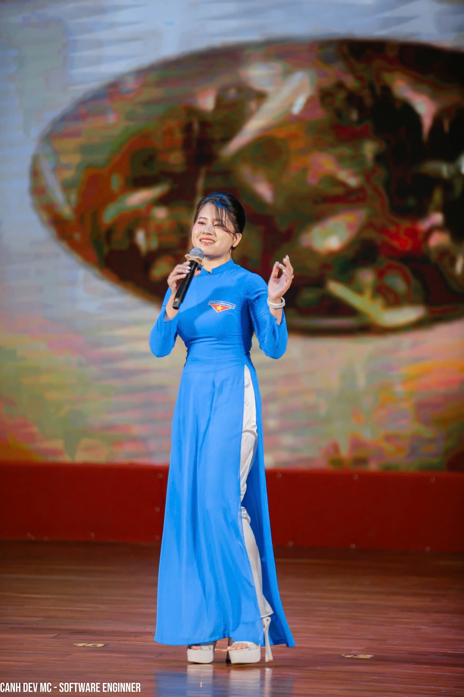
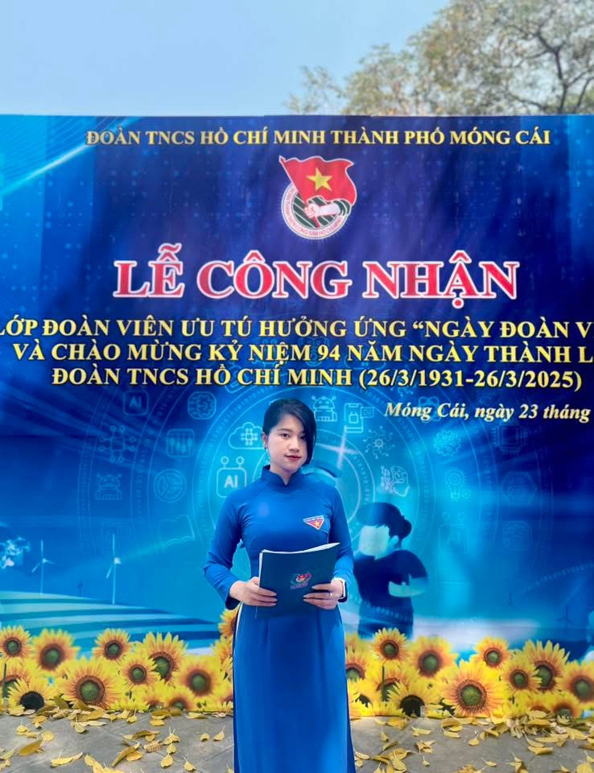

# 💖 Web UI Project – Giao Diện Viết Từ Cảm Xúc

> "Mỗi dòng code viết ra là một chút nhớ thương. Mỗi thành phần giao diện là một chút rung động." – _Cảnh Dev_

## 👋 Giới thiệu

Xin chào mọi người, mình là **Cảnh Dev**!

Đây là project giao diện web đơn giản, được mình tự phát triển dựa trên một bản thiết kế mà mình rất thích trên Figma. Nhưng không chỉ dừng lại ở việc thực hành code, đây còn là dự án mình dành tặng cho một người đặc biệt – **crush của mình** 💘.

Mình sử dụng những kiến thức đã học cùng một chút cảm xúc chân thành để tạo nên UI này. Hy vọng khi bạn xem qua, bạn sẽ cảm nhận được sự chỉn chu và cảm hứng bên trong nó.

## 🔧 Công nghệ sử dụng

| Tools         | Technical                       |
| ------------- | ------------------------------- |
| Ngôn ngữ      | ReactJS NextJS, CSS, JavaScript |
| CSS Framework | TailwindCSS _(nếu có)_          |
| UI Design     | [Figma](https://figma.com)      |

Mình cũng bỏ thời gian đưa ra những ý tưởng hay và đưa những cái theme xịn
